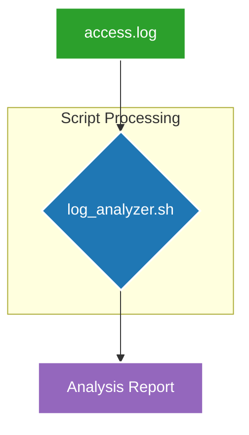

# Command-Line Web Server Log Analyzer

## 📖 Overview

This project provides a simple yet powerful Bash script for analyzing web server log files (e.g., from Apache or Nginx) directly from the Linux command line. It reads a standard `access.log` file and generates a concise summary report, providing quick insights into website traffic, popular pages, top visitor IPs, and error rates.

This tool is designed to be lightweight, fast, and easily customizable.

---

## ⚙️ Project Workflow

The script follows a simple, linear workflow: it takes a log file as input, processes it through a series of command-line tools, and outputs a formatted report to the terminal.



---

## 🚀 How to Use

### Prerequisites
- A Linux or macOS environment (or Windows with WSL).
- `bash` shell.

### Steps

1.  **Clone or download the repository:**
    ```bash
    # Replace with your repository URL
    git clone https://github.com/your-username/your-repo-name.git
    cd your-repo-name
    ```

2.  **Run the script:**
    The script is designed to be run with `bash`. No execute permissions are required with this method.
    ```bash
    bash log_analyzer.sh
    ```

3.  **Review the Output:**
    The report will be printed directly to your terminal.

---

## 📜 Code Explanation

The `log_analyzer.sh` script uses a combination of standard Linux utilities piped together to perform its analysis.

-   **`cat` or input redirection (`<`)**: Reads the content of the log file.
-   **`awk '{print $N}'`**: Extracts a specific column from each line (e.g., `$1` for the IP address, `$7` for the requested URL).
-   **`sort`**: Sorts the lines alphabetically, which groups identical items together.
-   **`uniq -c`**: Counts the number of adjacent identical lines and prefixes the count to the line.
-   **`sort -nr`**: Sorts the resulting lines numerically (`-n`) and in reverse (`-r`) to get the highest counts first.
-   **`head -n 5`**: Takes the top 5 lines from the sorted list.
-   **`grep`**: Searches for lines containing a specific pattern (used here to find `404` errors).
-   **`wc -l`**: Counts the total number of lines.

### Example Pipeline (Top 5 Pages):
```bash
awk '{print $7}' "$LOG_FILE" | sort | uniq -c | sort -nr | head -n 5
```
- **`awk`** gets the URL -> **`sort`** groups them -> **`uniq -c`** counts them -> **`sort -nr`** orders by count -> **`head`** gets the top 5.

---

## 📊 Sample Report

Running the script on the included `access.log` file produces the following report:

```
=======================================
      Web Server Log Analysis Report   
=======================================
Generated on: Fri Jul 18 07:04:46 EDT 2025

[*] Total Requests: 11

[*] Top 5 Most Requested Pages:
      3 /about.html
      3 /
      1 /products/item1.html
      1 /nonexistent-page.html
      1 /images/logo.png

[*] Top 5 Visitor IP Addresses:
      5 192.168.1.1
      2 74.125.135.101
      2 216.58.206.110
      2 104.18.32.200

[*] HTTP Status Code Summary:
      9 200
      2 404

[*] Total 404 (Not Found) Errors: 2

=======================================
          End of Report              
=======================================
```